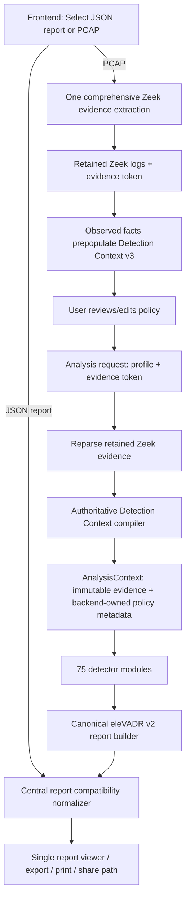

# eleVADR Detection Context + PCAP architecture

## End-to-end flow



Zeek normally runs **once per PCAP**. Detection Context discovery and detector execution are two consumers of the same extracted evidence.

## Ownership boundary

```text
+------------------------------- FRONTEND --------------------------------+
| Detection Context v3 UX                                                  |
| - upload PCAP once                                                       |
| - receive observed facts + opaque evidence token                         |
| - profile create/delete/edit                                             |
| - submit reviewed policy with evidence token                             |
| - common JSON/PCAP report normalizer + viewer                            |
+-----------------------------------|---------------------------------------+
                                    |
                                    v
+--------------------------- BACKEND OWNERSHIP -----------------------------+
| request/input validation                                                  |
| comprehensive one-time Zeek extraction + retained evidence lifecycle      |
| Detection Context v3 -> detector metadata compiler                        |
| AnalysisContext construction from retained logs                           |
| 75-detector registry execution                                            |
| per-module failure isolation                                              |
| canonical v2 report construction + evidence provenance                    |
| job status/cancellation/cleanup                                            |
+-----------------------------------|---------------------------------------+
                                    v
                              Canonical report
```

## Policy/evidence separation

```text
PCAP -> immutable Zeek evidence
          |                     \
          |                      -> detector evidence
          -> observed suggestions -> Detection Context review
                                        |
                                        -> authoritative detector policy
```

Observed evidence NEVER becomes authorization. Detection Context edits reinterpret the retained evidence; they do not modify or regenerate it.

## Production integration rule

`backend_bryan` is the isolated reference implementation. The production backend should incorporate these semantics into backend-owned packages rather than importing `backend_bryan` as a production dependency. `eleVADR/backend/` remains outside this checkpoint's ownership.
